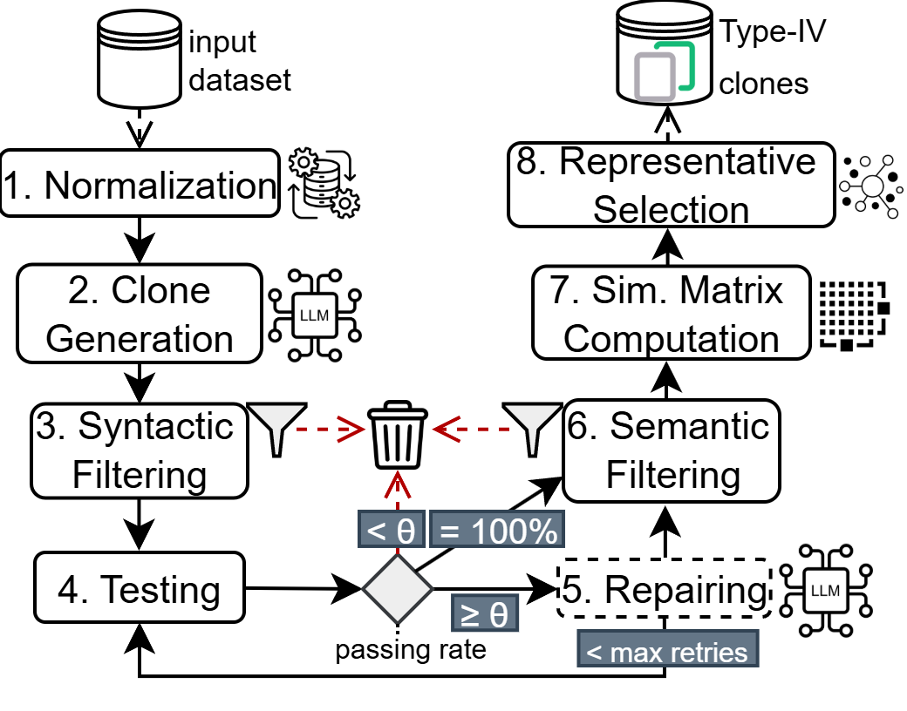

# KaminoDatasetGenerator
A pipeline to generate type 4 clones using LLMs and deterministic validation.




## Requirements 
* A hugging face token must be placed in a .env file in the root.
    * ```HF_TOKEN=token_here```
* Python 3 or newer
* Ollama running on a server (use the default OLLMAM port for local connection or 3333 for remote)
    * Port configurations can be changed in ```pipeline/src/resources```
* Inside the *pipeline* folder, run `pip install -r required_packages.txt` to install required packages -- depending on your Python kernel additional packages may need to be installed
* [MS C++ build tools](https://visualstudio.microsoft.com/pt-br/visual-cpp-build-tools/) -- make sure to install Desktop development with C++ (include Win 10/11 SDK and C++ CMake tools for Windows) -- this is **required by Codebleu**
## Configuration
The pipeline is pre-configured with the setup used for the experiments. 
To change the configuration, modify [config.py](pipeline/src/config.py)

## Running
Inside *pipeline* folder, run ```python -m src.main```

## Replicating experiments
Inside the ```pipeline``` folder, there is a Jupyter Notebook for each RQ follow the instructions there. 

Results are saved in ```results``` folder per RQ.

The dataset is available on ```dataset/kamino_clones_dataset``` 

